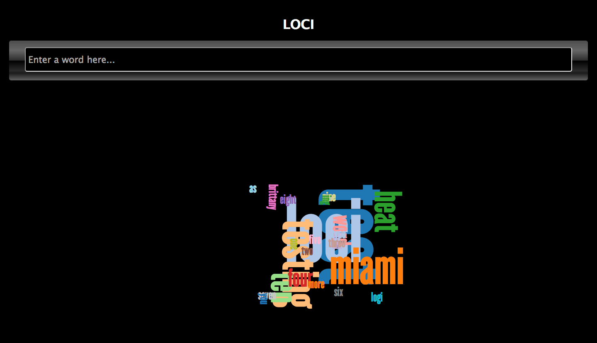

loci
====
Named after the method of loci http://en.wikipedia.org/wiki/Method_of_loci

# Description:
Enter a word and it saves to mogohq db. If the word exists the size property of the word increases and is visually displayed using https://github.com/jasondavies/d3-cloud/

## Live Demo:
http://feelobot-loci.jit.su/

